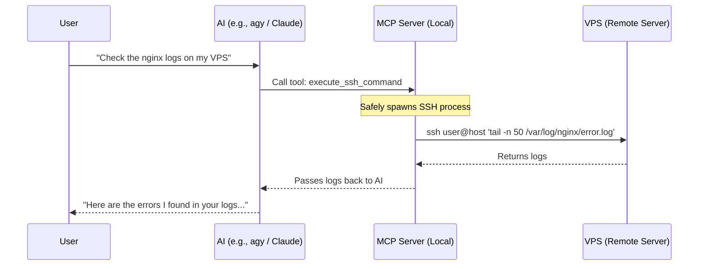

<div align="center">
  <h1>🚀 MCP Server: VPS Remote Control</h1>
  <p><strong>A secure, seamless bridge between your AI Assistant and your remote servers.</strong></p>
  <p><i>Works with Claude Code, Antigravity (agy), Codex, Cursor, Windsurf, and any MCP-compatible client!</i></p>
</div>

---

## 📖 Overview

The **VPS Remote Control** MCP (Model Context Protocol) server allows your local AI assistant to directly execute commands and transfer files on any of your remote servers via SSH and SCP.

Instead of manually logging into your VPS to check logs, restart services, or deploy code, you simply tell your AI to do it. The AI uses this MCP server to seamlessly execute the necessary bash commands directly on your server.

### 🌟 Killer Use Case: Seamless Session Transfer to VPS
Tired of your local machine doing all the heavy lifting? With this MCP server, you can effectively "transfer" your local AI session (from Claude, Agy, Codex, etc.) straight to your VPS! 

You can instruct your AI to:
1. Package your local code and upload it to the VPS using `scp_upload`.
2. Run installation scripts, start docker containers, or execute long-running build tasks on the VPS using `execute_ssh_command`.
3. Keep the workflow going remotely—acting as an always-on remote worker while your local machine stays fast and clean!


### 🎬 Explainer Video (Part 1: The Hook)
Check out this 10-second generated clip explaining why local AI needs remote access:
<br>
<video src="https://github.com/MohamedCHAMI/mcp-server-vps-remote/raw/main/assets/hook.mp4" controls width="100%"></video>


### How it Works



## ✨ Features

- 💻 **`execute_ssh_command`**: Execute arbitrary bash commands on a remote VPS via SSH.
- 📤 **`scp_upload`**: Securely upload local files or directories to the remote server.
- 📥 **`scp_download`**: Download remote files from the server directly to your local machine.
- 🔒 **Secure by Design**: Built using `execFile` to prevent local shell injection vulnerabilities. Zero hardcoded passwords or IP addresses.

## ⚙️ Installation

1. Clone and build the repository on your machine:

```bash
git clone https://github.com/MohamedCHAMI/mcp-server-vps-remote.git ~/mcp-server-vps-remote
cd ~/mcp-server-vps-remote
npm install
```

2. Run the automated configuration script. This will detect your installed AI CLIs (Claude, Agy, Codex) and automatically configure the MCP server for them!

```bash
npm run install-mcp
```

*(Restart your AI CLI after running this command!)*

---

## 🤖 Manual Configuration

If the automated script didn't detect your IDE, or if you are using a GUI-based assistant like Cursor or Cline, follow the manual steps below:

### 1. Cursor IDE
1. Open Cursor Settings > Features > MCP.
2. Click **+ Add New MCP Server**.
3. Name it `vps-remote`.
4. Set the Type to `stdio`.
5. Set the Command to: `node /absolute/path/to/your/home/mcp-server-vps-remote/index.js`

### 2. Cline (VS Code Extension)
In VS Code, open the Cline configuration file by clicking the MCP icon in the sidebar and adding:

```json
{
  "mcpServers": {
    "vps-remote": {
      "command": "node",
      "args": ["/absolute/path/to/your/home/mcp-server-vps-remote/index.js"]
    }
  }
}
```

### 3. Claude Code / Antigravity / Codex
If you prefer to configure them manually, simply edit their respective config files (`~/.claude.json`, `~/.gemini/config/mcp_config.json`, or `~/.codex/config.json`) and add:

```json
"mcpServers": {
  "vps-remote": {
    "type": "stdio",
    "command": "node",
    "args": ["/absolute/path/to/your/home/mcp-server-vps-remote/index.js"]
  }
}
```

---

## 🛠️ Usage Examples

Once configured, simply speak naturally to your AI:

- 🔍 *"Can you check the docker logs on my VPS? My username is root and the IP is 192.168.1.10"*
- 🚀 *"Upload this newly generated build folder to my remote server at admin@example.com:/var/www/html"*
- 📄 *"Download the nginx configuration file from my remote server so we can analyze it locally."*
- 🔄 *"Transfer my current workspace to the VPS and run the database migration script remotely."*

## 🛡️ Security & Authentication

This MCP server relies completely on your host system's native `ssh` and `scp` binaries. 

- **SSH Keys Required**: The server assumes you have SSH key-based authentication configured. It does not handle interactive password prompts. If your key requires a passphrase, ensure your `ssh-agent` is running.
- **No Stored Credentials**: The server does not store, cache, or hardcode any credentials, IPs, or usernames.
- **Zero Local Shell Injection**: Command arguments are passed directly to the binary execution layer, bypassing the local shell entirely.

## 📝 License

Released under the MIT License.
