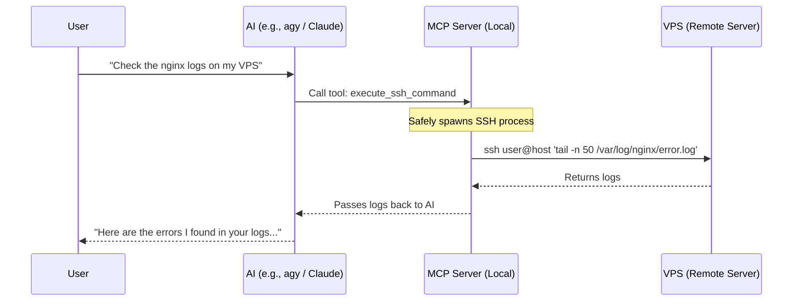

<div align="center">
  <h1>🚀 MCP Server: VPS Remote Control</h1>
  <p><strong>A secure, seamless bridge between your AI Assistant and your remote servers.</strong></p>
  <p><i>Works with Claude Code, Antigravity (agy), Codex, Cursor, Windsurf, and any MCP-compatible client!</i></p>
</div>

---

## 📖 Overview

The **VPS Remote Control** MCP (Model Context Protocol) server allows your local AI assistant to directly execute commands and transfer files on any of your remote servers via SSH and SCP.

Instead of manually logging into your VPS to check logs, restart services, or deploy code, you simply tell your AI to do it. The AI uses this MCP server to seamlessly execute the necessary bash commands directly on your server.

### 🌟 Killer Use Case: Seamless Session Transfer to VPS
Tired of your local machine doing all the heavy lifting? With this MCP server, you can effectively "transfer" your local AI session (from Claude, Agy, Codex, etc.) straight to your VPS! 

You can instruct your AI to:
1. Package your local code and upload it to the VPS using `scp_upload`.
2. Run installation scripts, start docker containers, or execute long-running build tasks on the VPS using `execute_ssh_command`.
3. Keep the workflow going remotely—acting as an always-on remote worker while your local machine stays fast and clean!

### How it Works



## ✨ Features

- 💻 **`execute_ssh_command`**: Execute arbitrary bash commands on a remote VPS via SSH.
- 📤 **`scp_upload`**: Securely upload local files or directories to the remote server.
- 📥 **`scp_download`**: Download remote files from the server directly to your local machine.
- 🔒 **Secure by Design**: Built using `execFile` to prevent local shell injection vulnerabilities. Zero hardcoded passwords or IP addresses.

## ⚙️ Installation

1. Clone and build the repository on your machine:

```bash
git clone https://github.com/MohamedCHAMI/mcp-server-vps-remote.git ~/mcp-server-vps-remote
cd ~/mcp-server-vps-remote
npm install
```

2. Run the automated configuration script. This will detect your installed AI CLIs (Claude, Agy, Codex) and automatically configure the MCP server for them!

```bash
npm run install-mcp
```

*(Restart your AI CLI after running this command!)*

---

## 🤖 Manual Configuration

If the automated script didn't detect your IDE, or if you are using a GUI-based assistant like Cursor or Cline, follow the manual steps below:

### 1. Cursor IDE
1. Open Cursor Settings > Features > MCP.
2. Click **+ Add New MCP Server**.
3. Name it `vps-remote`.
4. Set the Type to `stdio`.
5. Set the Command to: `node /absolute/path/to/your/home/mcp-server-vps-remote/index.js`

### 2. Cline (VS Code Extension)
In VS Code, open the Cline configuration file by clicking the MCP icon in the sidebar and adding:

```json
{
  "mcpServers": {
    "vps-remote": {
      "command": "node",
      "args": ["/absolute/path/to/your/home/mcp-server-vps-remote/index.js"]
    }
  }
}
```

### 3. Claude Code / Antigravity / Codex
If you prefer to configure them manually, simply edit their respective config files (`~/.claude.json`, `~/.gemini/config/mcp_config.json`, or `~/.codex/config.json`) and add:

```json
"mcpServers": {
  "vps-remote": {
    "type": "stdio",
    "command": "node",
    "args": ["/absolute/path/to/your/home/mcp-server-vps-remote/index.js"]
  }
}
```

---

## 🛠️ Usage Examples

Once configured, simply speak naturally to your AI:

- 🔍 *"Can you check the docker logs on my VPS? My username is root and the IP is 192.168.1.10"*
- 🚀 *"Upload this newly generated build folder to my remote server at admin@example.com:/var/www/html"*
- 📄 *"Download the nginx configuration file from my remote server so we can analyze it locally."*
- 🔄 *"Transfer my current workspace to the VPS and run the database migration script remotely."*

## 🛡️ Security & Authentication

This MCP server relies completely on your host system's native `ssh` and `scp` binaries. 

- **SSH Keys Required**: The server assumes you have SSH key-based authentication configured. It does not handle interactive password prompts. If your key requires a passphrase, ensure your `ssh-agent` is running.
- **No Stored Credentials**: The server does not store, cache, or hardcode any credentials, IPs, or usernames.
- **Zero Local Shell Injection**: Command arguments are passed directly to the binary execution layer, bypassing the local shell entirely.

## 📝 License

Released under the MIT License.

<br>

<details>
<summary><strong>🎥 Want to make a video about this tool? (Generated Omni Flash Prompts)</strong></summary>

We used the **Stickman Video Director** skill to generate a complete storyboard and production prompt package to explain this tool! You can copy and paste the 6 prompts below into Google's Gemini Omni Flash to generate a 60-second animated explainer video.

### 🎬 Prompt 1: The Hook
> Generate a 10-second 16:9 video at 720p, 24 FPS with synchronized audio.
> 
> **Visual Style & Constraints:** Use a flat, uniform, digitally pure-white canvas background. Absolutely no gray or off-white tint, texture, grain, gradients, vignette, shadows, ambient occlusion, lighting falloff, bloom, fog, color grading, or three-dimensional background depth. Use rapid scene changes, kinetic motion-graphic transformations, and frequent visual events, while preserving an identical stick-figure design, constant line weight, and strict temporal consistency. Character must be a simple stick figure with a hollow circular head, no face, no clothing, no filled body, stable proportions, and uniform medium black line weight. Limit accent colors strictly to Electric Blue and Warning Red. Do not include any visible words, letters, numbers, captions, subtitles, interface copy, logos, or watermarks.
> 
> **Composition:** Center-weighted action, fast-paced panic.
> 
> **Action Sequence:**
> **[0–3s]:** A black stick figure stands frantically typing on a laptop that is glowing Warning Red. 
> **[3–7s]:** The laptop starts smoking and shaking violently as heavy AI tasks overload it. 
> **[7–10s]:** The laptop explodes into a massive cloud of Warning Red smoke, leaving the stick figure covered in soot.
> 
> **Audio:**
> **Dialogue:** "Is your local machine overheating from running heavy AI coding agents? Keeping your agent trapped locally slows everything down." (Audio only. Do not add, omit, paraphrase, repeat, reorder, caption, subtitle, or visually transcribe words).
> **Voice:** Bright, energetic adult female voice speaking natural American English.
> **BGM & SFX:** Frantic, ticking lo-fi beat. Synchronize rapid typing at [1s], a kettle whistling sound at [4s], and a cartoon explosion at [7s]. Keep voiceover dominant over BGM.
> 
> **Negative Constraints:** No photorealism, no 3D rendering, no facial features, no hair, no clothing, no extra limbs, no malformed anatomy, no broken line weight, no inverted polarity, no visible writing.

### 🎬 Prompt 2: The Problem
> Generate a 10-second 16:9 video at 720p, 24 FPS with synchronized audio.
> 
> **Visual Style & Constraints:** Use a flat, uniform, digitally pure-white canvas background. Absolutely no gray or off-white tint... (No texture, grain, depth). Character must be a simple stick figure... (hollow circular head, uniform medium black line weight). Limit accent colors to Electric Blue and Warning Red. No visible writing.
> 
> **Composition:** Split screen or vast empty gap showing disconnection.
> 
> **Action Sequence:**
> **[0–3s]:** The red smoke clears to reveal the stick figure standing on a small floating island on the left. 
> **[3–7s]:** On the right, a massive, powerful server rack appears, but a giant, bottomless canyon separates them. 
> **[7–10s]:** The stick figure tries to throw a glowing Electric Blue paper airplane across the canyon, but it falls short and plummets into the abyss.
> 
> **Audio:**
> **Dialogue:** "The real problem? Your AI assistant is disconnected from your production VPS, forcing you to manually copy-paste code and restart servers." (Audio only).
> **Voice:** Bright, energetic adult female voice speaking natural American English.
> **BGM & SFX:** Drone-like, echoing beat. Synchronize a heavy thud as the server appears at [4s] and a sad whistle sound as the plane falls at [8s].
> 
> **Negative Constraints:** No photorealism, no 3D rendering, no facial features, no hair, no clothing, no extra limbs, no malformed anatomy, no broken line weight, no visible writing.

### 🎬 Prompt 3: The Solution
> Generate a 10-second 16:9 video at 720p, 24 FPS with synchronized audio.
> 
> **Visual Style & Constraints:** Use a flat, uniform, digitally pure-white canvas background... Character must be a simple stick figure... Limit accent colors strictly to Electric Blue and Warning Red. No visible writing.
> 
> **Composition:** Dynamic low-angle framing, bridging the gap.
> 
> **Action Sequence:**
> **[0–3s]:** Fast zoom out from the falling plane to reveal a glowing Electric Blue toolbox falling from the sky into the stick figure's hands. 
> **[3–7s]:** The figure opens the box, and a solid Electric Blue bridge instantly shoots out, seamlessly connecting the two floating islands. 
> **[7–10s]:** The figure excitedly runs across the glowing bridge. As they cross, the screen completely fills with a bright Electric Blue flash.
> 
> **Audio:**
> **Dialogue:** "Enter the VPS Remote Control MCP Server. It acts as a secure, seamless bridge, giving your AI direct SSH and SCP access to your remote server." (Audio only).
> **Voice:** Bright, energetic adult female voice.
> **BGM & SFX:** Upbeat, energetic lo-fi beat drops! Synchronize a magical chime at [2s], a heavy sci-fi deployment sound at [5s], and running footsteps at [7s].
> 
> **Negative Constraints:** No photorealism, no 3D rendering, no facial features, no clothing, no visible writing.

### 🎬 Prompt 4: The Process
> Generate a 10-second 16:9 video at 720p, 24 FPS with synchronized audio.
> 
> **Visual Style & Constraints:** Use a flat, uniform, digitally pure-white canvas background... Character must be a simple stick figure... Limit accent colors strictly to Electric Blue and Warning Red. No visible writing.
> 
> **Composition:** Lateral tracking left to right.
> 
> **Action Sequence:**
> **[0–3s]:** The blue flash clears to show the stick figure standing proudly in front of the massive server rack. 
> **[3–7s]:** The figure snaps their fingers, and glowing Electric Blue gears and wrenches appear, automatically flying into the server to perform maintenance. 
> **[7–10s]:** The server hums to life, radiating positive Electric Blue energy waves that ripple outward and cover the camera lens entirely.
> 
> **Audio:**
> **Dialogue:** "Now, your AI can automatically package your local session, upload it, and execute long-running build tasks directly on the remote machine." (Audio only).
> **Voice:** Bright, energetic adult female voice.
> **BGM & SFX:** Steady upbeat rhythm. Synchronize a clean finger snap at [3s], mechanical ratcheting sounds at [5s], and a deep electronic hum at [8s].
> 
> **Negative Constraints:** No photorealism, no 3D rendering, no facial features, no clothing, no visible writing.

### 🎬 Prompt 5: The Magic Feature (Session Transfer)
> Generate a 10-second 16:9 video at 720p, 24 FPS with synchronized audio.
> 
> **Visual Style & Constraints:** Use a flat, uniform, digitally pure-white canvas background... Character must be a simple stick figure... Limit accent colors strictly to Electric Blue and Warning Red. No visible writing.
> 
> **Composition:** Foreground to background depth transition.
> 
> **Action Sequence:**
> **[0–3s]:** The blue wave washes away to reveal the stick figure relaxing on a couch, holding a smartphone. 
> **[3–7s]:** The smartphone projects a glowing Electric Blue hologram of the server cheerfully spinning in the background. 
> **[7–10s]:** The stick figure gives a relaxed thumbs up to the camera while the hologram continues to work. The smartphone screen shines brightly, blinding the camera.
> 
> **Audio:**
> **Dialogue:** "The best part? You can transfer your entire AI session to the VPS, close your laptop, and monitor the remote agent straight from your phone!" (Audio only).
> **Voice:** Bright, energetic adult female voice.
> **BGM & SFX:** Relaxed, triumphant beat. Synchronize a high-tech hologram activation sound at [4s] and a pleasant ding at [8s].
> 
> **Negative Constraints:** No photorealism, no 3D rendering, no facial features, no clothing, no visible writing.

### 🎬 Prompt 6: Call to Action
> Generate a 10-second 16:9 video at 720p, 24 FPS with synchronized audio.
> 
> **Visual Style & Constraints:** Use a flat, uniform, digitally pure-white canvas background... Character must be a simple stick figure... Limit accent colors strictly to Electric Blue and Warning Red. No visible writing.
> 
> **Composition:** Wide hero shot, very stable framing.
> 
> **Action Sequence:**
> **[0–3s]:** The screen flash clears to show a massive, cinematic 16:9 terminal window icon. 
> **[3–7s]:** The stick figure jumps and high-fives the terminal. It explodes with joyful Electric Blue confetti. 
> **[7–10s]:** The stick figure takes a grand bow as the entire scene slowly fades to absolute white.
> 
> **Audio:**
> **Dialogue:** "Don't trap your AI on your desktop. Install the VPS Remote Control MCP Server today and give your agent global reach!" (Audio only).
> **Voice:** Bright, energetic adult female voice.
> **BGM & SFX:** Triumphant closing chord. Synchronize a high-five slap at [4s] and a party popper explosion at [5s].
> 
> **Negative Constraints:** No photorealism, no 3D rendering, no facial features, no clothing, no visible writing.

</details>
