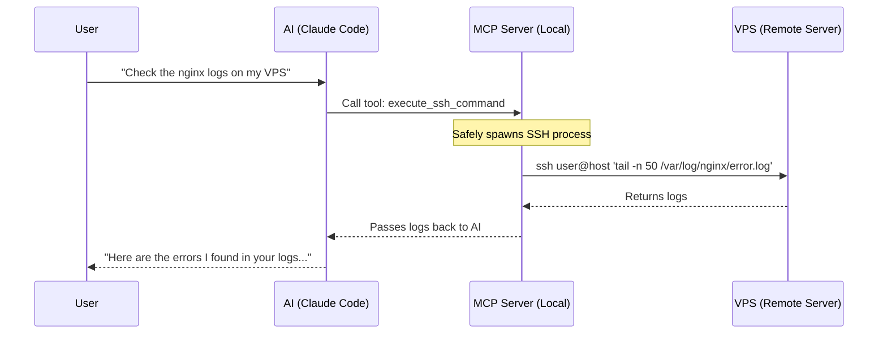

<div align="center">
  <h1>🚀 MCP Server: VPS Remote Control</h1>
  <p><strong>A secure, seamless bridge between your AI Assistant (like Claude) and your remote servers.</strong></p>
</div>

---

## 📖 Overview

The **VPS Remote Control** MCP (Model Context Protocol) server allows your local AI assistant to directly execute commands and transfer files on any of your remote servers via SSH and SCP.

Instead of manually logging into your VPS to check logs, restart services, or deploy code, you simply tell your AI to do it. The AI uses this MCP server to seamlessly execute the necessary bash commands directly on your server.

### How it Works



## ✨ Features

- 💻 **`execute_ssh_command`**: Execute arbitrary bash commands on a remote VPS via SSH.
- 📤 **`scp_upload`**: Securely upload local files or directories to the remote server.
- 📥 **`scp_download`**: Download remote files from the server directly to your local machine.
- 🔒 **Secure by Design**: Built using `execFile` to prevent local shell injection vulnerabilities. Zero hardcoded passwords or IP addresses.

## ⚙️ Installation & Setup

1. **Clone the Repository**
   Clone this project to a directory on your machine (e.g., `~/.claude/mcp/vps_remote`):
   ```bash
   git clone https://github.com/MohamedCHAMI/mcp-server-vps-remote.git ~/.claude/mcp/vps_remote
   cd ~/.claude/mcp/vps_remote
   npm install
   ```

2. **Configure Claude Code**
   Add the following configuration to your global `~/.claude.json` file under the `mcpServers` object:

   ```json
   "mcpServers": {
     "vps-remote": {
       "type": "stdio",
       "command": "node",
       "args": [
         "/Users/mohamedchami/.claude/mcp/vps_remote/index.js"
       ]
     }
   }
   ```
   *(Note: Adjust the absolute path to point to your specific installation directory).*

3. **Restart your AI CLI**
   Restart Claude Code to ensure the new MCP server is loaded.

## 🛠️ Usage Examples

You don't need to learn any complex commands. Just speak naturally to your AI:

- 🔍 *"Can you check the docker logs on my VPS? My username is root and the IP is 192.168.1.10"*
- 🚀 *"Upload this newly generated build folder to my remote server at admin@example.com:/var/www/html"*
- 📄 *"Download the configuration file from my remote server so we can analyze it locally."*

## 🛡️ Security & Authentication

This MCP server relies completely on your host system's native `ssh` and `scp` binaries. 

- **SSH Keys Required**: The server assumes you have SSH key-based authentication configured. It does not handle interactive password prompts. If your key requires a passphrase, ensure your `ssh-agent` is running.
- **No Stored Credentials**: The server does not store, cache, or hardcode any credentials, IPs, or usernames.
- **Zero Local Shell Injection**: Command arguments are passed directly to the binary execution layer, bypassing the local shell entirely.
- **Caution**: Granting an AI the ability to execute SSH commands means the AI can perform destructive actions on the remote server. We recommend using this within an environment where you can approve actions (like Claude Code's standard permission mode) before they execute.

## 📝 License

Released under the MIT License.
